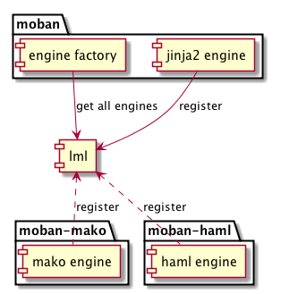

Development guide
=======================
                   
Jinja2 extensions for Moban
------------------------------

Since version 0.2, mobanfile supports an extra field `plugin_dir`, along with
`template_dir`. When you put your own jinja2 filters, tests and globals in
your moban repo, you can let moban know about them via this keyword.

Importantly, you have to have `__init__.py` file in your `plugin_dir`. Otherwise,
your plugins will NOT be loaded.

Jinja2 Filter
*******************

.. literalinclude:: ../moban/filters/repr.py

Jinja2 Test
*******************

.. literalinclude:: ../moban/tests/files.py

Jinja2 Globals
*******************

.. literalinclude:: ../tests/test_engine.py
   :lines: 49-61

It is possible to write an installable package including your own jinja2
filters, tests and globals. Please email me for more details.

Template engine extension for Moban
--------------------------------------------------------------------------------

moban version 0.2 started using `lml`_ to employ loose couple plugins. Other
template engines, such as marko, haml can be plugged into moban seamless.

In order plugin other template engines, it is to write a lml plugin. The following
is an example starting point for any template engine.

.. code::

   @PluginInfo(
       constants.TEMPLATE_ENGINE_EXTENSION, tags=["file", "extensions", "for", "your", "template"]
   )
   class Engine(object):
       def __init__(self, template_dirs):
           """
           A list template directories will be given to your engine class
           """
   
       def get_template(self, template_file):
           """
           Given a relative path to your template file, please return a templatable thing that does
           the templating function in next function below
           """
   
       def apply_template(self, template, data, output):
            """
            Given the template object from `get_template` function, and data as python dictionary, 
            and output as intended output file, please return "utf-8" encoded string.
            """

After you will have finished the engine plugin, you can either place it in `plugin_dir`
in order to get it loaded, or make an installable python package. In the latter case,
please refer to `yehua`_: doing that in less than 5 minutes.

.. _lml: http://lml.readthedocs.io
.. _yehua: http://yehua.readthedocs.io
